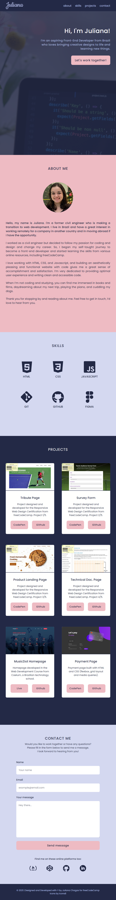
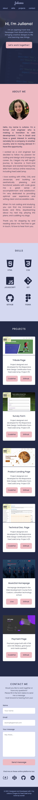

## freeCodeCamp - Personal Portfolio

Project created for the Responsive Web Design Certification from [freeCodeCamp](https://www.freecodecamp.org/learn).

Project 5/5: [Build a Personal Portfolio Webpage](https://www.freecodecamp.org/learn/responsive-web-design/responsive-web-design-projects/build-a-personal-portfolio-webpage)

## Technologies

- HTML/CSS

## Table of contents

- [Link](#link) 
- [Layout](#layout) 
- [My process](#my-process)
  - [Built with](#built-with)
  - [What I learned](#what-i-learned)
  - [Useful resources](#useful-resources)

## Link

- Live Site URL: [CodePen](https://codepen.io/julianachagas/full/JjrojBN)

## Layout
### Web 🖥️
<br/>
 <br/><br/>

### Tablet 📱
<br/>
 <br/><br/>

### Mobile 📱
<br/>
 <br/><br/>

## My process

### Built with

- Semantic HTML5 markup
- CSS custom properties
- CSS Flexbox
- CSS Grid Layout

### What I learned

- The CSS `@supports` at-rule

[MDN](https://developer.mozilla.org/en-US/docs/Web/CSS/@supports):

>The @supports CSS at-rule lets you specify declarations that depend on a browser's support for one or more specific CSS features. This is called a feature query.
>The @supports at-rule associates a block of statements with a supports condition.

In this project, the `@supports` at-rule was used for testing the browser's support for CSS Grid Layout. If the browser supports the CSS property `display: grid`, the Grid solution will be used. If not, the declarations will not be applied and it'll fall back to the alternative solution, which is CSS Flexbox, `display: flex`. This method was used in the Skills section and Projects section.

Solution with CSS Flexbox (fallback):

```css
.skills-wrapper {
  max-width: 50%;
  margin: 0 auto;
  display: flex;
  flex-wrap: wrap;
  justify-content: space-between;
}

.skills-item {
  align-items: center;
  width: 30%;
  margin-bottom: 4.5rem;
}

.skills {
  padding-bottom: 6.75rem;
}
```

Solution with CSS Grid Layout, using `@supports`

```css
@supports (display: grid) {
  .skills-wrapper {
    display: grid;
    grid-template-columns: repeat(auto-fit, minmax(7.5rem, 1fr));
    gap: 4.5rem;
  }

  .skills-item {
    width: initial;
    margin-bottom: initial;
  }

  .skills {
    padding-bottom: 11.25rem;
  }

  @media screen and (max-width: 550px) {
    .skills-wrapper {
      gap: 2.5rem;
    }

    .skills {
      padding-bottom: 9.25rem;
    }
  }
}
```
<br/>

- The CSS `object-fit` property

[MDN](https://developer.mozilla.org/en-US/docs/Web/CSS/object-fit):

>The object-fit CSS property sets how the content of a replaced element, such as an `` or `<video>`, should be resized to fit its container.

The property can have one of the following values: `fill` (initial value), `contain`, `cover`, `none` and `scale-down`.

With the initial value, `fill`, the image will be resized to fit the aspect ratio of its container, if the image’s aspect ratio doesn’t match the container’s, it will be either squeezed or stretched. 

To avoid that, `object-fit: contain` was used in the Skills section, and `object-fit: cover` was used in the About section and Projects section.

In the Skills section, the logos might have different sizes, we need a way to resize them without distorting them, and `object-fit: contain` is a good solution for that. The aspect ratio will be preserved and the entire logo will fit within the container and will not be clipped or distorted in case the aspect ratio doesn't match the aspect ratio of the container.

- contain: 
>The replaced content is scaled to maintain its aspect ratio while fitting within the element’s content box. The entire object is made to fill the box, while preserving its aspect ratio, so the object will be "letterboxed" if its aspect ratio does not match the aspect ratio of the box.

In the Projects section, the thumbnails might not have the same aspect ratio as the container, `object-fit: cover` can help adjust the thumbnails so they'll be filling the entire container even if the aspect ratio is different (in that case, the image will be clipped to fit). The same happens with the profile image in the About section, `object-fit: cover` will make sure that the image fills the container without being distorted.

- cover: 
>The replaced content is sized to maintain its aspect ratio while filling the element’s entire content box. If the object's aspect ratio does not match the aspect ratio of its box, then the object will be clipped to fit.

<br/>

```css
.skills-img {
  object-fit: contain;
  width: 100px;
  height: 100px;
}
```

```css
.about-img img {
  border-radius: 50%;
  width: 100%;
  height: 100%;
  object-fit: cover;
}
```

```css
.project-img img {
  border-radius: 7px 7px 0 0;
  position: absolute;
  top: 0;
  left: 0;
  width: 100%;
  height: 100%;
  object-fit: cover;
}
```
<br/>

### Useful resources

Three articles by Ahmad Shadeed, UX designer and front-end developer, that helped me in this project:

- [Grid for layout, Flexbox for components](https://ishadeed.com/article/grid-layout-flexbox-components/?utm_source=pocket_mylist) - Great article about the difference between Grid and Flexbox and how to decide which one to use.
- [A Deep Dive Into object-fit And background-size In CSS](https://www.smashingmagazine.com/2021/10/object-fit-background-size-css/?utm_source=pocket_mylist) - This is an amazing article that helped me understand the `object-fit` property, when and why we should use it.
- [Aligning Logo Images in CSS](https://ishadeed.com/article/aligning-logos-css/) - Great article about how to better organize and style logos of different sizes.

<br/>

***
##### Made with 💜 by Juliana Chagas 